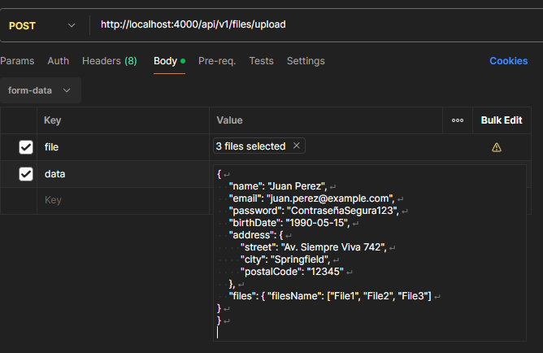

## Project Description:
The project aims to enhance file upload processes by enabling the inclusion of additional data alongside the file payload. This is accomplished by allowing the submission of JSON strings, which are then converted into valid JSON objects that align with our Data Transfer Object (DTO) specifications. Through this mechanism, the system performs necessary validations as outlined in the DTO to ensure data integrity and compliance with predefined requirements. Essentially, this project introduces a robust framework for handling file uploads, where the accompanying extra data is seamlessly integrated and validated, streamlining the process and improving data handling efficiency.

## How to send info in postman

